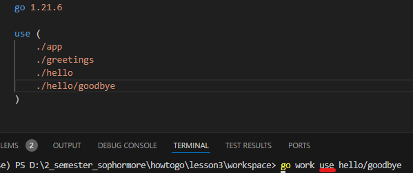

# HOTOGO-LESSON3

# MULTI-MODULE WORKSPACE

- This is simple lesson that teach us how to manipulate with multi-module workspace effectively
    
    `go work init`
    
    `go work use` 
    

## 1.Go work init


This is the file structure that have three sub-folders, each of them contains a dependency tracking **go.mod**

`go work init` simplifies dependency management by centralizing references in the `go.work` file, improving organization and clarity.

Syntax, particularly in this project:

```go
go work init ./hello ./greetings ./app
```

In this command ./hello, ./greetings,./app are relative path to the folder. After we run the above command we will have the [go.work](http://go.work) file which is shown below:


## 2.Go work use

Initially, when we create the project we can use `go work init` to help tracking all the dependency in project, so how can we add a new dependency tracking to [**go.work](http://go.work) file.** Here is how we do the work.

Let’s create a goodbye modules in hello folder, like the images below:


And then we run the command `go work use hello/goodbye`  where hello/goodbye is the relative path to folder. Here is the [go.work](http://go.work) file after i run `go work use hello/goodbye` command.



## 3.Starting using all the module


This is the main function where all module in the project are called

## Reference:

[Getting started with multi-module workspaces](https://go.dev/doc/tutorial/workspaces)