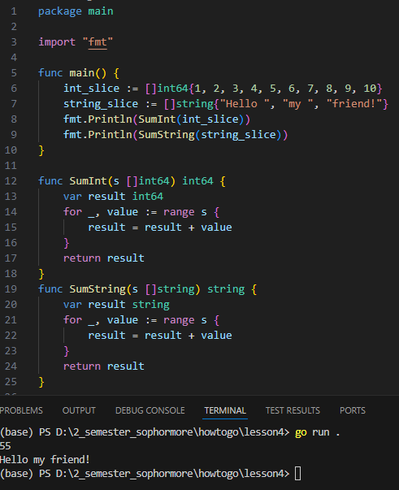
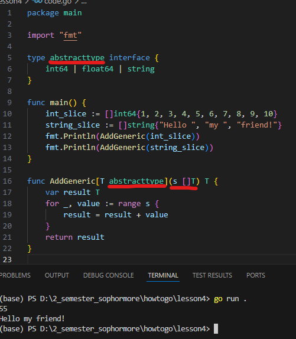

# HOTOGO-LESSON4

# GENERICS

## This lesson helps us understand generic support in go lang

Suppose that we are given a problems to adding elements of int slice and string slice, how can we do that?

It is very easy problems to solve, the code will be given below:



We write two function, each of the handle for the respective data type.

## Are there anyway to shorten the code?

That’s when generic come into a solution



Firstly, we must define the abstract data type which have the intended of your design.

```go
type abstracttype interface {
	int64 | float64 | string
}
```

Secondly, we will analyse how the generic function is constructed.

```go
func AddGeneric[T abstracttype](s []T) T {
	var result T
	for _, value := range s {
		result = result + value
	}
	return result
}
```

Inside the squared bracket, we’ve got the type constraint of which the generic types is defined this is only the key different at generic function compared to the ordinary one.